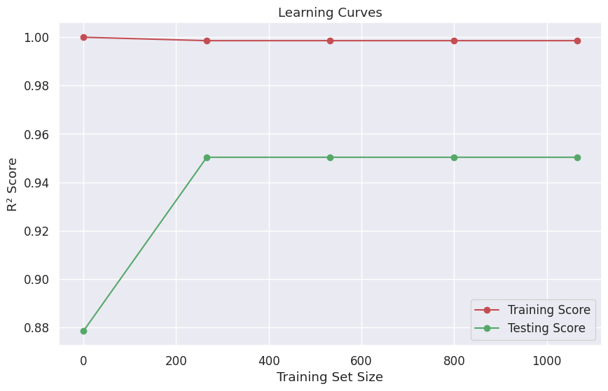
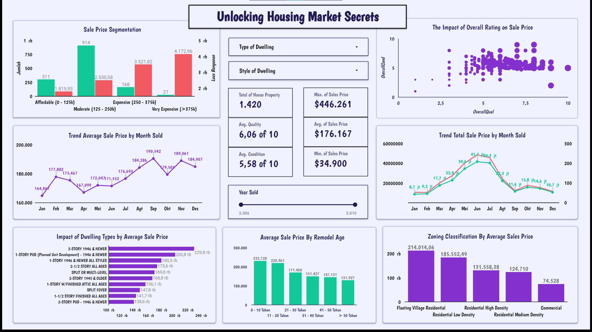

# Housing Price Regression

**Dataset** : [source](https://www.kaggle.com/competitions/home-data-for-ml-course/data)  
**Notebook** : [view](https://github.com/much66/Housing-Prices-Using-RFRegressor/blob/main/Housing%20Prices%20Regression.ipynb) 

 

**Table of Contents**
- [Business Understanding](https://github.com/much66/Housing-Prices-Using-RFRegressor/blob/main/README.md#-business-understanding)
- [Workflow](https://github.com/much66/Housing-Prices-Using-RFRegressor/blob/main/README.md#-workflow)
- [Insight](https://github.com/much66/Housing-Prices-Using-RFRegressor/blob/main/README.md#-insight)
- [Modeling and Evaluation](https://github.com/much66/Housing-Prices-Using-RFRegressor/blob/main/README.md#-modeling-and-evaluation)
- [Recommendation](https://github.com/much66/Housing-Prices-Using-RFRegressor/blob/main/README.md#-recommendations)
 

## 📂 Business Understanding
### Problem Statement
Dalam pasar real estate, berbagai faktor mempengaruhi harga akhir dari sebuah properti residensial selain dari fitur-fitur yang jelas seperti luas tanah dan bangunan atau jumlah kamar. Memahami faktor-faktor ini sangat penting untuk penilaian properti yang akurat dan negosiasi harga yang sukses. Dataset yang disediakan untuk kompetisi ini mencakup 79 variabel yang menangkap hampir setiap aspek dari rumah-rumah residensial di Ames, Iowa. Variabel-variabel ini mencakup atribut fisik, detail lokasi, dan faktor signifikan lainnya yang mempengaruhi harga rumah.

Tantangannya adalah membangun model prediktif yang dapat menentukan harga akhir sebuah rumah dengan akurat berdasarkan variabel-variabel ini. Ini akan membantu agen real estate, pembeli, dan penjual dalam membuat keputusan yang lebih baik, sehingga meningkatkan efisiensi pasar perumahan.

### Goals
a. Pengurangan Kerugian: Mengurangi dampak kerugian yang ditimbulkan oleh penetapan harga rumah yang tidak akurat melalui model prediktif yang dapat diandalkan.

b. Keputusan yang Lebih Baik: Membantu agen real estate, pembeli, dan penjual dalam membuat keputusan yang lebih baik dan berbasis data mengenai harga rumah.
  
### Objectives
a. Membangun Model Prediktif:
- Mengembangkan model regresi yang mampu memprediksi harga akhir rumah dengan akurasi tinggi.
- Menggunakan teknik pemodelan lanjutan seperti XGBoost, Random Forest, dan metode lain untuk meningkatkan performa prediksi.
  
b. Mengidentifikasi Faktor Kunci Penentu Harga:
- Melakukan eksplorasi dan analisis data secara menyeluruh untuk memahami hubungan antara berbagai fitur dan harga rumah.
- Mengidentifikasi dan merangking variabel-variabel yang paling signifikan yang mempengaruhi harga rumah melalui analisis kepentingan fitur.
 

## 📂 Workflow

- Data Mentah
   - Mengumpulkan dataset yang mencakup informasi rumah residensial di Ames, Iowa.
   - Memperoleh data mengenai fitur-fitur rumah seperti ukuran, lokasi, kondisi, dan harga jual.

- Preprocessing Data
   - Memeriksa dan membersihkan data dari nilai-nilai yang hilang atau tidak valid.
   - Melakukan penanganan outlier, misalnya dengan menggunakan Z-score normalization untuk mengatasi outlier pada fitur-fitur seperti `GrLivArea` dan `LotArea`.

- Exploratory Data Analysis (EDA)
   - Menganalisis distribusi fitur-fitur utama seperti harga rumah, kualitas material (`OverallQual`), luas lantai (`GrLivArea`), dan lokasi.
   - Mengidentifikasi korelasi antara fitur-fitur dan mengeksplorasi pola-pola menarik dalam data.

- Feature Engineering
   - Membuat fitur baru yang dapat meningkatkan kemampuan model, seperti umur rumah (`YearBuilt`) dan informasi tambahan tentang lingkungan (`Neighborhood`).
   - Transformasi variabel kategorikal menjadi bentuk yang dapat diproses oleh model, misalnya menggunakan teknik encoding seperti One-Hot Encoding.

- Pembagian Dataset
   - Memisahkan dataset menjadi dua bagian: data pelatihan (80%) dan data pengujian (20%) untuk menguji kinerja model.

- Modeling
   - Menggunakan berbagai algoritma machine learning seperti XGBoost dan Random Forest untuk membangun model prediktif.
   - Melakukan tuning hyperparameter untuk meningkatkan performa model.
   - Melakukan validasi silang (cross-validation) untuk menguji keandalan model.

- Evaluasi Model 
   - Mengevaluasi performa model menggunakan metrik yang sesuai seperti R2 Score dan Mean Absolute Error untuk regresi.
   - Membandingkan performa berbagai model untuk memilih model terbaik.

- Pembuatan Dashboard Interaktif dengan Looker Studio
   - Menggunakan hasil rekomendasi dari model terbaik, buat dashboard interaktif menggunakan Looker Studio.
   - Tambahkan visualisasi dan filter interaktif untuk memperjelas dan memudahkan pemahaman hasil rekomendasi.
   - Atur tata letak dashboard agar informasi disajikan dengan jelas dan efisien.

 

## 📂 Insight
- Distribusi Harga Rumah: Rata - rata harga rumah di dataset ini adalah $176,000, dengan harga tertinggi mencapai $446,000 dan harga terendah $34,900.
- Faktor Utama yang Mempengaruhi Harga Rumah:
  - Kualitas Material dan Selesai: Rumah dengan kualitas material dan selesai yang lebih tinggi (misalnya, OverallQual dan OverallCond) memiliki harga yang signifikan lebih tinggi.
  - Ukuran Rumah: Luas lantai di atas tanah (GrLivArea) dan total area basement (TotalBsmtSF) secara signifikan berkontribusi terhadap harga rumah.
  - Lokasi: Zoning Classification, seperti di lingkungan Floating Village, menunjukkan harga yang lebih tinggi dibandingkan dengan lingkungan lainnya.
  - Fitur Ekstra: Keberadaan fitur tambahan seperti garasi (GarageCars), kolam renang (PoolArea), dan renovasi terbaru (YearRemodAdd) juga meningkatkan nilai rumah.
 

## 📂 Modeling and Evaluation
- Split dataset dengan rasio 75% Train : 25% Test
- Handling Missing Values: Mengisi nilai yang hilang dengan metode yang sesuai, seperti median untuk nilai numerik dan modus untuk nilai kategorikal.
- Feature Engineering: Membuat fitur baru yang mungkin relevan seperti umur rumah (YearBuilt).
- Scaling Data: Menggunakan Z-Score normalization untuk menormalkan data agar mengatasi outliers.
- Algoritma XGBoost Regressor dan Random Forest Regressor digunakan sebagaim 2 model komparasi untuk regressi pada penentuan harga rumah ini.
- Hyperparameter Tuning menggunakan grid search untuk meningkatkan performa model.
- Hasil akhir menunjukan performa dari Random Forest Regressor lebih baik dibanding XGBoost dengan R2 Score sebesar 91.6% dan good fit, dibanding XGBoost yang memiliki R2 Score 95% namun model terindikasi overfit.
 

    

        <kbd>  </kbd>  
        Gambar 1 — Final XGBoost Evaluation
    

   
    

        <kbd>  </kbd>  
        Gambar 2 — Final Random Forest Evaluation
    

 

## 📂 Recommendations
- Fokus pada Kualitas dan Ukuran:
   - Pertimbangkan untuk meningkatkan kualitas material dan penyelesaian rumah, seperti memperbaiki atau mengganti elemen-elemen utama yang dapat meningkatkan `OverallQual` dan `OverallCond`.
   - Perluas ruang lantai di atas tanah (`GrLivArea`) dan pertimbangkan untuk memperbesar lahan (`LotArea`) jika memungkinkan, karena ini merupakan faktor signifikan dalam meningkatkan nilai rumah.
- Lokasi yang Strategis:
   - Investasi dalam properti yang terletak di lingkungan bernilai tinggi seperti `NridgHt` dapat memberikan pengembalian yang lebih baik. Pertimbangkan lokasi dengan akses mudah ke fasilitas utama dan lingkungan yang diminati.
- Perawatan dan Pemeliharaan Rumah:
   - Pertimbangkan untuk melakukan renovasi atau pemeliharaan secara rutin, karena rumah yang lebih terurus dan diperbarui (`YearRemodAdd`) menunjukkan nilai yang lebih tinggi. Rumah yang terawat dengan baik cenderung memiliki harga jual yang lebih baik di pasar.
 

    <kbd></kbd>  
    Gambar 3 — <a href="https://lookerstudio.google.com/reporting/8ca7f8ae-8867-4555-824b-7d8e8834dd4c" target="_blank">Dashboard</a>

